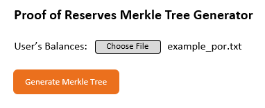
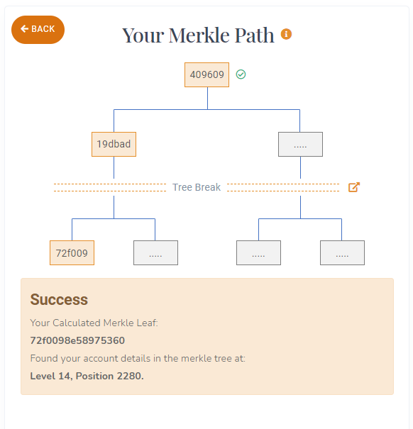
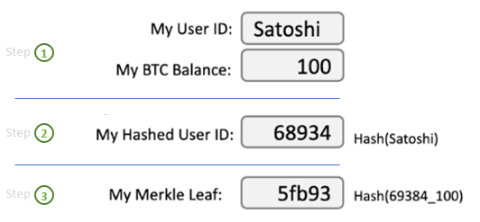
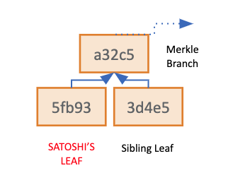
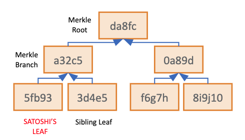
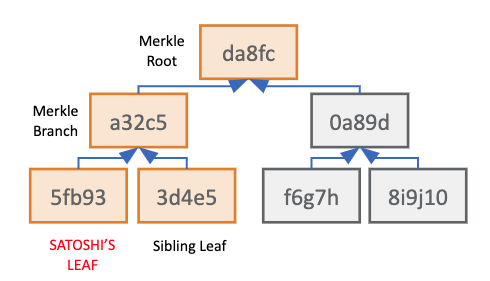
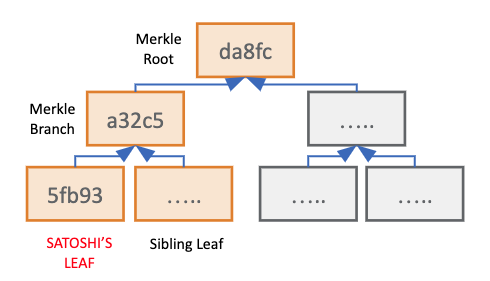

# Proof-of-Reserves Merkle Tree

This ReadMe introduces the background and technical details supporting the Merkle Tree Generator and Verifier utilized
in Armanino’s Proof-of-Reserves agreed-upon procedures process.

Many customized versions of Merkle Tree Generators and Verifiers may exist. Currently, this repository is specific to a
Merkle Tree Generator and Verifier that ingests a user identified with _4_ customer platform account balances.

The relevant format for this instance is:

<strong>[User Identifier, Acct. Bal #1, Acct. Bal #2, Acct. Bal #3, Acct. Bal #4]</strong>

An example of how an individual user’s platform account data manifests within the Customer Liability Extract:

<strong>[483759v3, 0.04, 5.123, 4.25, 1.000005]</strong>

In the future, we plan to expand the functionality of this Merkle Tree Generator and Verifier to be able to identify and
ingest ‘n’ number of customer platform account balances.

## Background

Armanino’s Proof-of-Reserves process employs a Merkle Tree approach to give users the ability to independently verify
their individual funds were included within the total Customer Liabilities figure as calculated within the
Proof-of-Reserves assessment.

## Process Overview

1) ### Auditor generates the Merkle tree with user balances provided by a digital asset platform

   The auditor observes the generation of the Customer Liability by the digital asset platform and observes the report’s
   delivery to the auditor.<sup>1</sup> The auditor will then import the user balances into the Merkle Tree Generator to
   generate the Merkle Tree.

   <p align="center">
    
   </P>

2) ### Auditor verifies the total user balance and publishes the Merkle Tree and the Merkle Root Hash

   After the Merkle Tree is successfully generated, the Merkle Root Hash, the total User Count, and the Total Asset
   amounts will be calculated and written to separate files within the tool directory for the auditor to verify.

3) ### Users independently verify their account balance
   After importing the plain text file generated from the Merkle Tree Generator into the Merkle Tree Verifier, users
   will input their Hashed User ID and/or asset balance(s)<sup>2</sup> to trigger the verification process. If the
   Hashed User ID and the asset balance(s) match the record in the Merkle Tree, a successful result will be displayed
   with the node location of the user information within the Merkle Tree. The Merkle Tree Root Hash will also be
   re-calculated using the imported file for users to verify the Root Hash.
   <sup>3</sup>
   <p align="center">
    
   </p>

## Additional Context regarding Merkle Trees

### What is Merkle Tree?

A Merkle Tree is a cryptographic tool that enables the consolidation of large amounts of data into a single hash. This
single hash, called a Merkle Root, acts as a cryptographic seal that “summarizes” all the inputted data. Additionally,
Merkle Trees give users the ability verify to specific contents were included within a particular set of “sealed” data.
Armanino uses these properties of Merkle Trees during our Proof of Reserves assessments to verify individual user
accounts are included within the Customer Liability Extract generated by a digital asset platform and inspected by the
auditor.

Merkle Trees are used by Bitcoin, Ethereum, and many other blockchain protocols to “fingerprint” or provide a single
unique hash for all transactions included within a particular block. Armanino uses a very similar strategy during our
Proof of Reserves to create a single unique hash for all user accounts within a platform’s trading database.

### Building the Merkle Tree with Hashed User IDs and User Balances

The Merkelization process begins by segregating each individual data point within the data set. For a Proof of Reserves
assessment, each individual data point is a unique hashed user ID and the user’s platform balances as tracked with in a
platform’s database. Independent auditors, such as Armanino, only see the customer’s hashed user ID, never any
personally identifiable information. The user’s hashed user ID and platform account balances are then hashed one more
time using SHA256 to create a unique and private hash value, which acts as a personal Merkle Leaf for each user.

   <p align="center">
    
   </p>

We can then use a similar approach as used in Bitcoin and other blockchains to consolidate all of the Merkle Leaves for
each user into a single hash, known as the Merkle Root.

To create the Merkle Root, one user’s Merkle Leaf is paired up with another user’s Merkle leaf (a “Sibling” Leaf) and
hashed together, creating a new, unique hash that summarizes the 2 user’s data within a single Merkle Branch. This
process is repeated until all user’s Merkle Leaves are consolidated into the single Merkle Root. The Merkle Root
represents a hash that includes all hashed user IDs and account balances from the platform’s database. Because hash
functions are “one-way streets,’ a single individual who knows the Root Hash cannot travel backward through the tree to
unseal information about leaves or branches. A user that knows the raw or original inputs for a single Merkle Leaf, can
validate that those unique inputs were in fact used/included in the Merkelization process.

  <p align="center">
    
  </p>

The process began with individual and sibling Merkle Leaves (hashed User ID + account balances), which flow through the Merkle
Branches (intermediate hashes) to a Merkle Root (consolidated hash of all data), thus completing a full Merkle Tree!

  <p align="center">
    
  </p>

### Verifying the Hashed User ID and Balances using a Merkle Proof

Since the Merkle Root is related to every individual Merkle Leaf, a user can recalculate their individual path to the
Root to ensure their user details were included within a Proof of Reserves. To perform this task, a user needs their
personal Merkle Leaf hash and every Sibling Leaf hash used along its path the Merkle Root. This is known as a user’s
Merkle Path.

  <p align="center">
    
  </p>

TrustExplorer’s Merkle Tree Visualizer does not currently include the Sibling Leaves in a user’s Merkle Tree Path due to
the large computational power needed to calculate each intermediate Merkle Branch within the browser. TrustExplorer
plans to add this functionality in the future.

  <p align="center">
    
  </p>


## How to run

This is a command line only tool. In order to run it you first need to install dependencies using npm or yarn and then
run node cli --help to see all available command line options.

Here is a summary of the available options for your convenience:

```shell
Usage: cli [options]

Options:
  -c, --concatenate      If set, compute the leaves as SHA256(user_id,balance1:k,...,balancen:n). Otherwise the calculation is SHA256(SHA256(user_id)SHA256(balance1...balancen))
  -n, --newline <value>  Sets the type of line endings to expect from the input file. The output file will match this style. Possible options are crlf or lf. (default: "crlf")
  -t, --threads <value>  Number of worker threads to split the cpu intensive parts in. Defaults to all available CPUs -1. Be mindful that running lots of threads requires lots of memory so if you are getting heap out of memory exceptions try limiting the number of threads
  -i, --input <value>    Input filename (default: "input.csv")
  -h, --help             display help for command

```

-----------------

<sup>1</sup> The process may vary slightly during each Proof of Reserves. Please refer to each independent Proof of
Reserves Agreed Upon Procedures report for specific procedures regarding this process.

<sup>2</sup> Each Proof of Reserve dashboard may be customized. In some instances, users can “query” for their platform
account balances on the Proof of Reserves dashboard, nullifying the need for a user to manually input user their own
balances. However, users may and should verify the platform account balances provided by the query results on a Proof of
Reserves dashboard.

<sup>3</sup> Shown as implemented within
the https://proof-of-reserves.trustexplorer.io/clients/[digitalAssetPlatformName] dashboards
